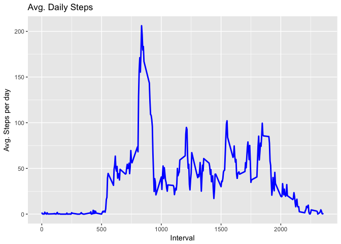
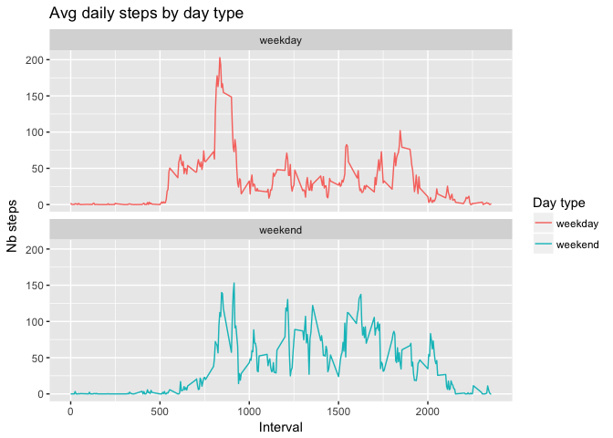

## Loading and preprocessing the data

Show any code that is needed to

### 1. Load the data (i.e. 𝚛𝚎𝚊𝚍.𝚌𝚜𝚟())


```r
setwd("/Users/clu/Desktop/Coursera/Reproducible Research/")

library("data.table")
```

```
## Warning: package 'data.table' was built under R version 3.4.2
```

```r
library(ggplot2)

fileUrl <- "https://d396qusza40orc.cloudfront.net/repdata%2Fdata%2Factivity.zip"
download.file(fileUrl, destfile = paste0(getwd(), '/repdata%2Fdata%2Factivity.zip'), method = "curl")
unzip("repdata%2Fdata%2Factivity.zip",exdir = "data")
```

### 2. Process/transform the data (if necessary) into a format suitable for your analysis

Data file is read and data is stored in a DataTable


```r
activityDT <- data.table::fread(input = "data/activity.csv")
```

## What is mean total number of steps taken per day?

For this part of the assignment, you can ignore the missing values in the dataset.

### 1. Calculate the total number of steps taken per day


```r
TotalStepsByDay <- activityDT[, c(lapply(.SD, sum, na.rm = FALSE)), .SDcols = c("steps"), by = .(date)] 
head(TotalStepsByDay,5)
```

```
##          date steps
## 1: 2012-10-01    NA
## 2: 2012-10-02   126
## 3: 2012-10-03 11352
## 4: 2012-10-04 12116
## 5: 2012-10-05 13294
```

### 2. If you do not understand the difference between a histogram and a barplot, research the difference between them. Make a histogram of the total number of steps taken each day


```r
ggplot(TotalStepsByDay, aes(x = steps)) +
    geom_histogram(fill = "blue", binwidth = 1000) +
    labs(title = "Daily Steps", x = "Steps", y = "Frequency")
```

```
## Warning: Removed 8 rows containing non-finite values (stat_bin).
```

<!-- -->

```r
## Warning: Removed 8 rows containing non-finite values (stat_bin).
```

### 3. Calculate and report the mean and median of the total number of steps taken per day


```r
TotalStepsByDay[, .(MeanStepsByDay = mean(steps, na.rm = TRUE), MedianStepsByDay = median(steps, na.rm = TRUE))]
```

```
##    MeanStepsByDay MedianStepsByDay
## 1:       10766.19            10765
```

## What is the average daily activity pattern?

### 1. Make a time series plot (i.e. 𝚝𝚢𝚙𝚎 = "𝚕") of the 5-minute interval (x-axis) and the average number of steps taken, averaged across all days (y-axis)


```r
intervalDT <- activityDT[, c(lapply(.SD, mean, na.rm = TRUE)), .SDcols = c("steps"), by = .(interval)] 
ggplot(intervalDT, aes(x = interval , y = steps)) + geom_line(color="blue", size=1) + labs(title = "Avg. Daily Steps", x = "Interval", y = "Avg. Steps per day")
```

<!-- -->


### 2. Which 5-minute interval, on average across all the days in the dataset, contains the maximum number of steps?


```r
intervalDT[steps == max(steps), .(max_interval = interval)]
```

```
##    max_interval
## 1:          835
```

## Imputing missing values

Note that there are a number of days/intervals where there are missing values (coded as 𝙽𝙰). The presence of missing days may introduce bias into some calculations or summaries of the data.

### 1. Calculate and report the total number of missing values in the dataset (i.e. the total number of rows with 𝙽𝙰s)


```r
activityDT[is.na(steps), .N ]
```

```
## [1] 2304
```

### 2. Devise a strategy for filling in all of the missing values in the dataset. The strategy does not need to be sophisticated. For example, you could use the mean/median for that day, or the mean for that 5-minute interval, etc.


```r
# Filling in missing values with median of dataset. 
activityDT[is.na(steps), "steps"] <- activityDT[, c(lapply(.SD, median, na.rm = TRUE)), .SDcols = c("steps")]
```

### 3. Create a new dataset that is equal to the original dataset but with the missing data filled in.


```r
data.table::fwrite(x = activityDT, file = "data/ImputedData.csv", quote = FALSE)
```


### 4. Make a histogram of the total number of steps taken each day and Calculate and report the mean and median total number of steps taken per day. Do these values differ from the estimates from the first part of the assignment? What is the impact of imputing missing data on the estimates of the total daily number of steps?


```r
# total number of steps taken per day
TotalSteps <- activityDT[, c(lapply(.SD, sum)), .SDcols = c("steps"), by = .(date)] 

# mean and median total number of steps taken per day
TotalSteps[, .(MeanSteps = mean(steps), MedianSteps = median(steps))]
```

```
##    MeanSteps MedianSteps
## 1:   9354.23       10395
```

## Are there differences in activity patterns between weekdays and weekends?

For this part the 𝚠𝚎𝚎𝚔𝚍𝚊𝚢𝚜() function may be of some help here. Use the dataset with the filled-in missing values for this part.

### 1. Create a new factor variable in the dataset with two levels – “weekday” and “weekend” indicating whether a given date is a weekday or weekend day.


```r
activityDT <- data.table::fread(input = "data/activity.csv")
activityDT[, date := as.POSIXct(date, format = "%Y-%m-%d")]
activityDT[, `Day of Week`:= weekdays(x = date)]
activityDT[grepl(pattern = "Lundi|Mardi|Mercredi|Jeudi|Vendredi", x = `Day of Week`), "Day type"] <- "weekday"
activityDT[grepl(pattern = "Samedi|Dimanche", x = `Day of Week`), "Day type"] <- "weekend"
activityDT[, `Day type` := as.factor(`Day type`)]
head(activityDT, 10)
```

```
##     steps       date interval Day of Week Day type
##  1:    NA 2012-10-01        0       Lundi  weekday
##  2:    NA 2012-10-01        5       Lundi  weekday
##  3:    NA 2012-10-01       10       Lundi  weekday
##  4:    NA 2012-10-01       15       Lundi  weekday
##  5:    NA 2012-10-01       20       Lundi  weekday
##  6:    NA 2012-10-01       25       Lundi  weekday
##  7:    NA 2012-10-01       30       Lundi  weekday
##  8:    NA 2012-10-01       35       Lundi  weekday
##  9:    NA 2012-10-01       40       Lundi  weekday
## 10:    NA 2012-10-01       45       Lundi  weekday
```

### 2. Make a panel plot containing a time series plot (i.e. 𝚝𝚢𝚙𝚎 = "𝚕") of the 5-minute interval (x-axis) and the average number of steps taken, averaged across all weekday days or weekend days (y-axis). See the README file in the GitHub repository to see an example of what this plot should look like using simulated data.


```r
activityDT[is.na(steps), "steps"] <- activityDT[, c(lapply(.SD, median, na.rm = TRUE)), .SDcols = c("steps")]
intervalDT <- activityDT[, c(lapply(.SD, mean, na.rm = TRUE)), .SDcols = c("steps"), by = .(interval, `Day type`)] 

ggplot(intervalDT , aes(x = interval , y = steps, color=`Day type`)) + geom_line() + labs(title = "Avg daily steps by day type", x = "Interval", y = "Nb steps") + facet_wrap(~`Day type` , ncol = 1, nrow=2)
```

<!-- -->

